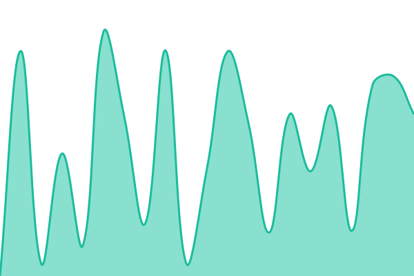
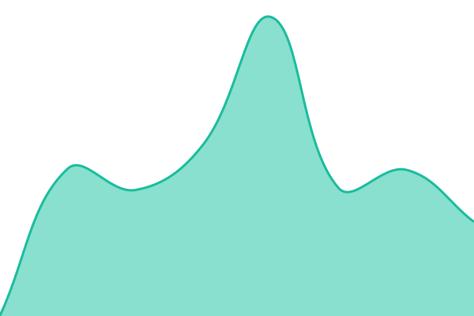
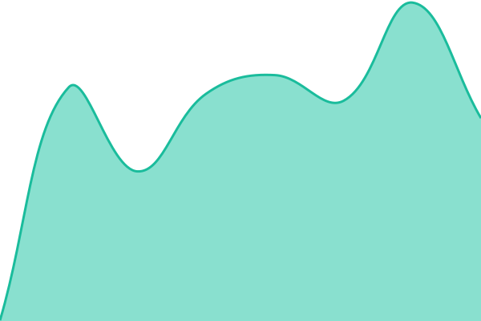

# [📈 Live Status](https://imbkz.github.io/pingpong): <!--live status--> **🟧 Partial outage**

This repository contains the open-source uptime monitor and status page for [imbkz](https://imbkz.github.io/pingpong), powered by [Upptime](https://github.com/upptime/upptime).

With [Upptime](https://upptime.js.org), you can get your own unlimited and free uptime monitor and status page, powered entirely by a GitHub repository. We use [Issues](https://github.com/imbkz/pingpong/issues) as incident reports, [Actions](https://github.com/imbkz/pingpong/actions) as uptime monitors, and [Pages](https://imbkz.github.io/pingpong) for the status page.

<!--start: status pages-->
<!-- This summary is generated by Upptime (https://github.com/upptime/upptime) -->
<!-- Do not edit this manually, your changes will be overwritten -->
<!-- prettier-ignore -->
| URL | Status | History | Response Time | Uptime |
| --- | ------ | ------- | ------------- | ------ |
|  [CAclubindia](https://www.caclubindia.com/forum/display.asp) | 🟥 Down | [c-aclubindia.yml](https://github.com/imbkz/pingpong/commits/HEAD/history/c-aclubindia.yml) | 

 935ms
     
 | 

<a href="https://imbkz.github.io/pingpong/history/c-aclubindia">96.59%</a>
    

|  [LawyersClubIndia](https://www.lawyersclubindia.com/forum/display.asp) | 🟩 Up | [lawyers-club-india.yml](https://github.com/imbkz/pingpong/commits/HEAD/history/lawyers-club-india.yml) | 

 416ms
     
 | 

<a href="https://imbkz.github.io/pingpong/history/lawyers-club-india">100.00%</a>
    

|  [CAclubindianet](https://www.caclubindia.net/webhook.php) | 🟥 Down | [c-aclubindianet.yml](https://github.com/imbkz/pingpong/commits/HEAD/history/c-aclubindianet.yml) | 

 338ms
     
 | 

<a href="https://imbkz.github.io/pingpong/history/c-aclubindianet">96.66%</a>
    

<!--end: status pages-->

[**Visit our status website →**](https://imbkz.github.io/pingpong)

## 📄 License

- Powered by: [Upptime](https://github.com/upptime/upptime)
- Code: [MIT](./LICENSE) © [Anand Chowdhary](https://anandchowdhary.com)
- Data in the `./history` directory: [Open Database License](https://opendatacommons.org/licenses/odbl/1-0/)
